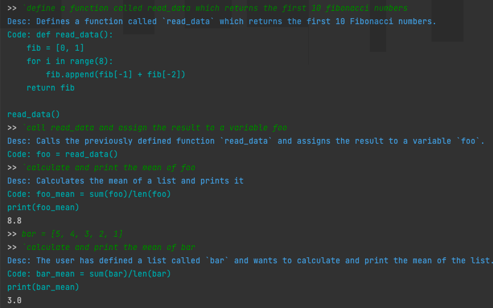
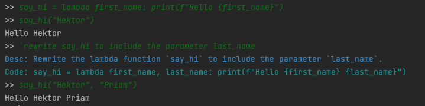

# GEPL - Generate, Execute, Print, Loop
A proof of concept Python REPL enhanced with Chat GPT.

Read [Building a ChatGPT-enhanced Python REPL](https://isthisit.nz/posts/2023/building-a-chat-gpt-enhanced-python-repl/) for details on the approach, architecture, and impressions of coding with LLMs.

ChatGPT can modify code you wrote locally in the GEPL.

# Installation

    git clone git@github.com:lmortimer/gepl.git
    cd gepl

Create `gepl/.env` with contents

    OPENAI_KEY="Your-OpenAPI-key"

Optional: Create a python virtual environment

    pip install -r requirements.txt

Run GEPL

    python gepl.py

# Prompts
## Context

This first prompt generates a request to a website that requires an API key. We don't have one.

Prompt:

    >> `write a function that returns the weather forecast today in melbourne

Response:

    Desc: The following code defines a function that returns the weather forecast for today in Melbourne using the OpenWeatherMap API. The function takes an API key and a city name as input parameters and returns the weather forecast for today in Celsius.
    Code: import requests
    
    def get_weather_forecast(api_key, city):
        url = f'http://api.openweathermap.org/data/2.5/weather?q={city}&appid={api_key}&units=metric'
        response = requests.get(url)
        if response.status_code == 200:
            data = response.json()
            temp = data['main']['temp']
            return f'The temperature in {city} is {temp}°C today.'
        else:
            return 'Error: Could not retrieve weather forecast.'
    
    # Example usage:
    api_key = 'your_api_key_here'
    city = 'Melbourne'
    print(get_weather_forecast(api_key, city))

Output:

    Error: Could not retrieve weather forecast.

We can say "try again" and it remembers the task it was trying to solve.

Prompt: 

    `try again using the bbc website

Response:

    Desc: The user previously asked to write a function that returns the weather forecast today in Melbourne. The previously generated code uses the OpenWeatherMap API to retrieve the weather forecast. However, the code was not executed and the user was asked to try again using the BBC website.
    Code: # Importing necessary libraries
    import requests
    from bs4 import BeautifulSoup
    
    # URL of the BBC weather page for Melbourne
    url = 'https://www.bbc.com/weather/2158177'
    
    # Retrieving the HTML content of the page
    response = requests.get(url)
    
    # Parsing the HTML content using BeautifulSoup
    soup = BeautifulSoup(response.content, 'html.parser')
    
    # Extracting the temperature information from the parsed HTML
    temp = soup.find('span', {'class': 'wr-value--temperature--c'}).get_text()
    
    # Extracting the weather condition information from the parsed HTML
    condition = soup.find('div', {'class': 'wr-day__weather-type-description'}).get_text()
    
    # Printing the weather forecast for Melbourne
    print(f'Today\'s weather in Melbourne: {temp}°C and {condition}.')

Output:

    Today's weather in Melbourne: 16°°C and Thundery showers and a gentle breeze.

## Do a multistage task

Prompt:

    `using only builtin libraries and requests write a function that counts the number of times the word lisp appears on the page https://isthisit.nz/posts/2022/implementing-general-computation/

Response:

    Desc: The following code uses the requests library to send a GET request to the webpage https://isthisit.nz/posts/2022/implementing-general-computation/ and counts the number of times the word "lisp" appears on the page.
    Code: import requests
    
    def count_lisp_occurrences():
        url = "https://isthisit.nz/posts/2022/implementing-general-computation/"
        response = requests.get(url)
        if response.status_code == 200:
            content = response.text.lower()
            return content.count("lisp")
        else:
            return 0

Output: 

    >> print(count_lisp_occurrences())
    2

